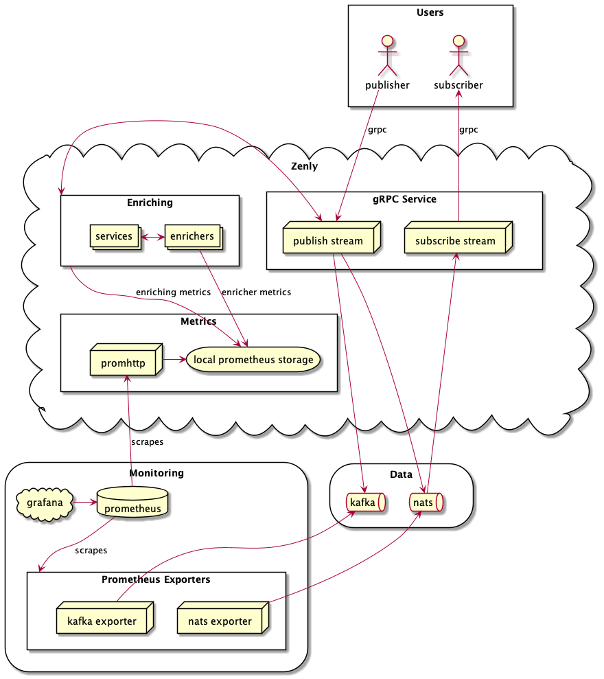

# zenly-task

[Task description](zenly-task.md)

## Getting Started

### Requirements:
- **Docker**
- **Docker Compose**

Optional:
- **GoLand** for running prepared configurations (load testing tool, application with grpc service)
- **protoc**, **protoc-gen-go-grpc** for generating protobuf implementations
- **plantuml** for generating architecture diagram

### Start
Start all (infrastructure, monitoring, application):
```bash
make up
```
#### OR
Start infrastructure (ZooKeeper, Kafka, NATS):
```bash
make infra-up
```
Start monitoring (Prometheus, Prometheus Exporters, Grafana):
```bash
make monitoring-up
```
Start application:
```bash
make app-up
```

### Stop
Stop all
```bash
make down
```
#### OR
Stop infrastructure:
```bash
make infra-down
```
Stop monitoring:
```bash
make monitoring-down
```
Stop application:
```bash
make app-down
```

## Architecture Overview


## Key Points
### Architecture
- NATS uses subject per stream for user geolocations
- gRPC publish stream [calls enrichers](zenly/enrich.go) and publishes the enriched geolocation to the NATS subject
- Each enricher has 100ms to complete and returns [SetFunc](zenly/enricher/enricher.go) to set the value to the geolocation if the context isn't timeout-ed yet
- Enrichers are supposed to use [services](zenly/service) to get external data (e.g. [weather enricher](zenly/enricher/weather.go) uses [weather service](zenly/service/weather/service.go) to get fake weather data at location)
- gRPC subscribe stream subscribes to multiple NATS subjects using [MultiSub](zenly/bus/nats/multisub/multisub.go) with message handler sending all incoming enriched geolocations to client

### Monitoring:
- Enriching process reports each enricher's time and result (timeout / in time), and total enriching time and finish reason (complete / timeout)
- Grafana at http://localhost:3000/ with username `admin` and password `admin`
